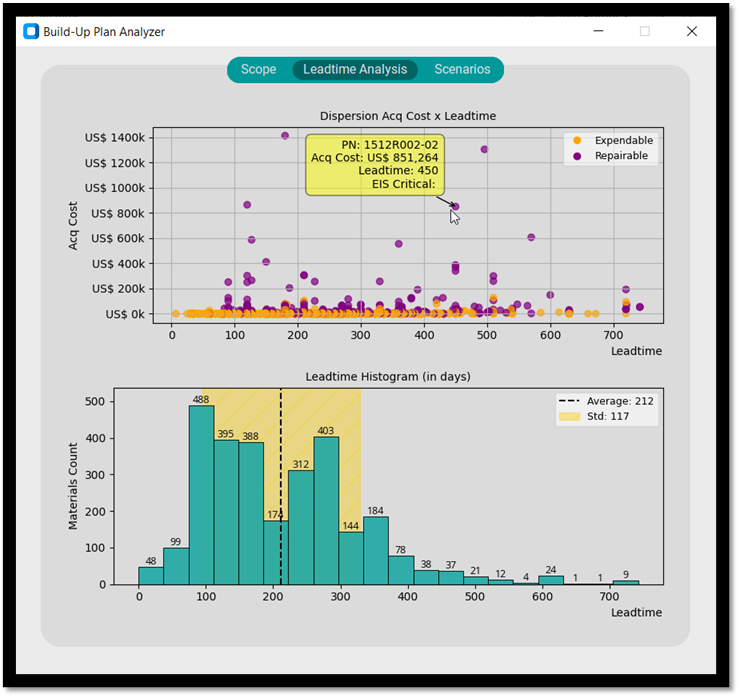
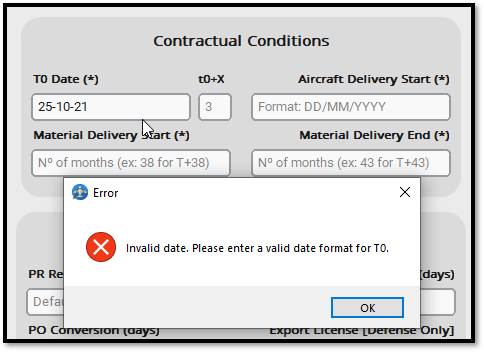
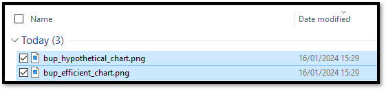

# Build-Up Plan Analyzer
###### Version 3.1
### What Is?

This is a desktop application developed with the intent (at first) to provide the possibility for the Engineers to create and compare different Scenarios (with different Dates and Supply Chain parameters assumptions), mainly when dealing with contractual commitments for stock Build-Up in the aeronautical business.

It was developed on a procedural paradigm.
BUP_GUI.py file is the main one, where you can execute the application.
bup_plan_analyzer.py has the main functions of the system.
___
### How it Works

A scope file with the materials list corresponding to the contract is a mandatory input.
The information that should contain in the scope file (.xlsx Excel format) is as follows:
- 'PN': *text*
- 'ECODE': *numeric*
- 'QTY': *numeric*
- 'SPC': *numeric*
- 'EIS': *boolean* **('X' or not filled)**

#### __**Example:**__ 

**OBS**: It is important that the columns description is exactly the same as described in this documentation.  
The Excel file can have as many tabs as you want, as long as **the first tab contains the contractual scope information**, with columns mentioned above.

___
### How to Use

As an end-user, you have been granted access through a folder with the application files, with an executable (.exe) one.  
You can make it a desktop shortcut if you want. Run it doubleclicking.

The main screen should appear after a while:

Click on 'Search Scope File'

A window with explorer will appear. Choose your scope file and click Open: 

It may take a while since complementary information is fetched at this moment in the application. You can check the average time elapsed for this function in the 'execution_info.log' file, also in the application folder.

Having it done, another screen should appear, in the first tab called "Scope", where you can see all loaded parts with their respective complementary information.  
You can also make sure that the file loaded is correct by checking file name, rows quantity and Contract Value (US$):

In the second tab, called "Leadtime Analysis", is presented two charts in order to evaluate Leadtime distribution:

The third tab "Scenarios" is where the simulation charts for Efficient Chart and Hypothetical Chart will be presented.  
First you need to click on "Create Scenario" to create a forecast scenario.

After that, a window will open with the information to be filled:

Make sure to fill correctly all information considering instructions on label placeholders.  

### **Contractual Conditions** 

These are **required information** (except 't0+X', that is an *Integer* with default 3 [months] for Hypothetical Build-Up Start date based on t0) and an error will be raised if any of the information has not been filled in.  

In addition, any other format that is not consistent with the format indicated in the attribute's "placeholder" will result in an error and the creation of the scenario won't be possible.

### **Procurement Length** 

These are **optional** arguments. They all have a default value indicated on the attribute placeholder displaying what will be the value assumed if nothing is filled.  

It is important to note that there is also a verification of the data type here. An *Integer* is expected **if any value is filled in**, anything different from this (i.e: *text*, or special characters) will generate an error and make it impossible to create the Scenario.

You can just leave it empty to adopt Default values.

In case there is already a previously registered Scenario, the program will automatically identify and, before displaying the Scenario Creation window, a message offering the option to use the values of the **first** registered Scenario will be displayed.

If the user chooses **"Yes"**, the **Contractual Condition** values will be assumed and "locked" on the Scenario creation window, leaving only open Procurement Length fields to be configured in a different operational Scenario for comparison.

If the user chooses **"No"**, the Scenario creation window will normally open with all enabled options.

After clicking **"OK"**, if everything is filled correctly, the Scenario will be created and the Efficient and Hypothetical charts will be generated in their respective tabs.

___

#### **Efficient Curve:**

This chart plots the **best date to issue the Purchase documents**, considering the Leadtime of each material and the respective Procurement Length values.

**The estimated Delivery Date of the material to this chart will always be on the average date between the Material Delivery Start Date & Material Delivery End Date**, that is, the colored range vertically with the respective Scenario's color, to where the down arrow points.

That's why it is entitled **Efficient**, from the cash point of view. **It is the most optimized capital allocation considering the current operational parameters.**

Two Scenarios can be created in order to compare their curves:

(v1.0 charts comparison)

Or the Curves can be evaluated in terms of **Parts (orange)** and **Cash (green)**, and it can be toggled using upper switch.

(v2.0 Charts Screen)

#### **Hypothetical Curve:**

This chart presents the RSPL build-up in a way to identify when all materials would be delivered, if all were purchased simultaneously on a Hypothetical date **("X" months after Contract signature [t0]. Default: 3)**.

The line represents **materials delivery**, along with a circle marker of when all materials would have been delivered and build-up will be completed.

This is why it is called **Hypothetical**, as it is based on the hypothesis of starting the entire build-up from a specific date, purchasing all materials at once in a date indicated when creating the scenario.

Same for this Hypothetical, Scenarios can be created in order to compare their curves: 

(v1.0 charts comparison)

Or the Curves can be evaluated in terms of **Parts (orange)** and **Cash (green)**.

(v2.0 Charts Screen)

#### **Cost Avoidance Curve:**

**This is where the savings between Hypothetical and Efficient asset allocation is compared.** 

A Cost of Capital label are allowed in order to simulate between different financial scenarios.

Also, a Cost Savings/Loss is calculated considering a simulation of X% Efficient Gain/Loss, based on days quantity for Procurement Length (operational parameters).

___
### Exporting Data

There are features available in the application to export the information generated by the system.

#### 1- Excel Spreadsheet

One is to export the tables that are used to create the Scenarios to Excel.

After clicking the export button, a file named **'bup_scenarios_data.xlsx'** is saved in your Downloads directory (**Windows only**) with 2 tabs:

- #### BUP Scope with Scenarios

This is the tab that contains the contractual scope (materials), along with the complementary information read, in addition to the Scenarios created, with their respective defined dates.

In addition to the **'PN Order Date'** column, which represents the **optimized date to issue the purchase document** for a respective material (from the Efficient chart), there is also the **'Delivery Date Hypothetical'** column, which represents the **delivery date of each material, having purchased all on the hypothetical date based on t0**.

- #### Scenarios Build-Up

This is the tab that contains the consolidated and grouped information, used to generate the two charts **Efficient Curve** and **Hypothetical Curve**.

Column E **['Accum. Ordered Qty (Eff)']** represents the accumulated quantity **purchased** for each month **(Efficient chart)**, while column F **['Accum. Delivered Qty (Hyp)']** represents the accumulated quantity **delivered** for each month **(Hypothetical chart)**.

**OBS:** In case the spreadsheet 'bup_scenarios_data.xlsx' is open in the operating system, or the logged user does not have access to the Downloads folder, an error will be presented indicating that the file could not be saved and that the conflicts must be solved.

#### 2- Chart Images

The second feature is the possibility to save images of generated charts (Efficient and Hypothetical).

When you click the button, the images will be saved in .png format, depending on the screen you are on.  

**'bup_efficient_chart.png' if in the Efficient Curve tab**  
**'bup_hypothetical_chart.png' if in the Hypothetical Curve tab**

---
###### *© Paulo Roberto de Sá Araújo, 2024*

