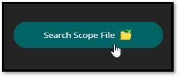
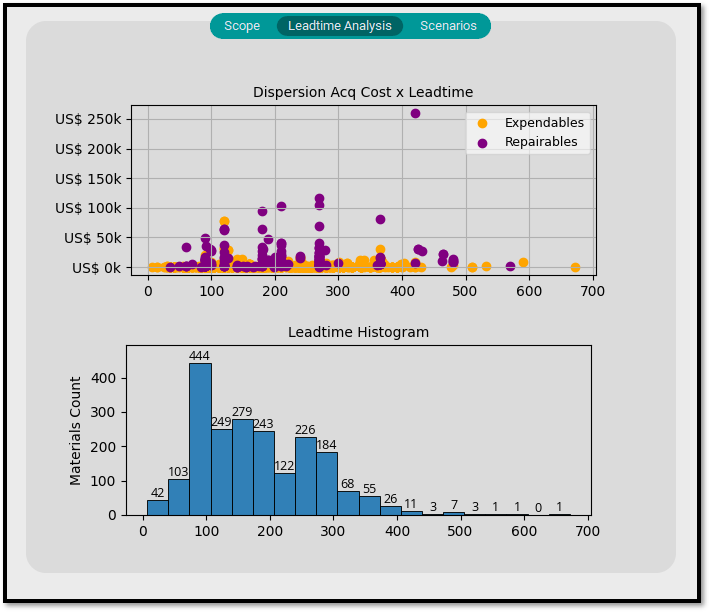

# Build-Up Plan Analyzer
###### Version 1.0
### What Is?

This is a desktop application developed with the intent (at first) to provide the possibility for the Engineers to create and compare different Scenarios (with different Dates and Supply Chain parameters assumptions), mainly when dealing with contractual commitments for stock Build-Up in the aeronautical business.

It was developed on a procedural paradigm.
BUP_GUI.py file is the main one, where you can execute the application.
bup_plan_analyzer.py has the main functions of the system.
___
### How it Works

A scope file with the materials list corresponding to the contract is an essential input.
The information that should contain in the scope file (.xlsx Excel format) is as follows:
- 'PN': *text*
- 'ECODE': *numeric*
- 'QTY': *numeric*
- 'SPC': *numeric*
- 'EIS': *boolean* **('X' or not filled)**

#### __**Example:**__ 

**OBS**: It is important that the columns description is exactly the same as described in this documentation.  
The Excel file can have as many tabs as you want, as long as **the first tab contains the contractual scope information**, with columns mentioned above.

___
### How to Use

As an end-user, you have been granted access through a folder with the application files, with an executable (.exe) one.  
You can make it a desktop shortcut if you want. Run it doubleclicking.

The main screen should appear after a while:

Click on 'Search Scope File'

A window with explorer will appear. Choose your scope file and click on 

It may take a while since complementary information is fetched at this moment in the application. You can check the average time elapsed for this function in the 'execution_info.log' file, also in the application folder.

Having it done, another screen should appear, in the first tab called "Scope", where you can see all loaded parts with their respective complementary information.  
You can also make sure if the file loaded is correct, by checking file name, rows quantity and Contract Value (US$):

In the second tab, called "Leadtime Analysis", is presented two charts in order to evaluate Leadtime distribution:

In the third tab "Scenarios", is

